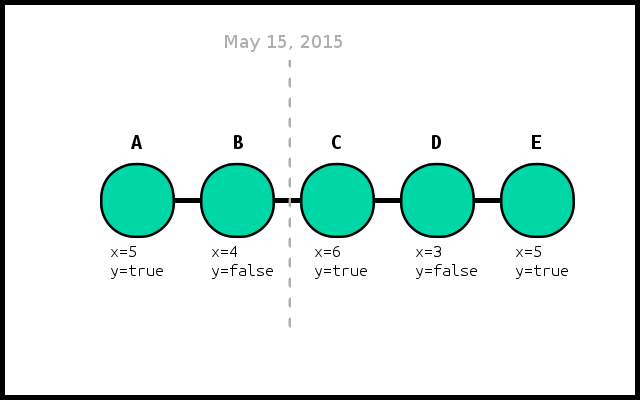

# 2git

The 2git project is an SCM migration engine that enables you to migrate to git using a Groovy DSL.
It allows you to document your migration in a Groovy DSL and execute it by passing it to the 2git engine.
If you don't like what you see, you can easily tweak your recipe and run it again, until you get the perfect migration.

## Getting started

Currently, 2git only supports migrating from ClearCase and ClearCase UCM.
The current guide to [getting started](http://www.2git.io/getting-started/) is limited to ClearCase UCM.

For your convenience, we'll be adding easy-to-run examples relying on ZIP files in the near future.
 
## User documentation

For detailed information and docs, please refer to [2git.io](http://www.2git.io/).

## Workflow and concepts

Independent of the source VCS, 2git follows a simple, but flexible, migration workflow.
The 2git DSL is used to build up a migration plan, which is then executed by the migration engine. 

 * Build a migration plan
   1. Select source snapshots matching defined criteria
   2. Assign actions to selected snapshots
 * Execute the migration plan
   1. Checkout the next source snapshot
   2. Execute the snapshot's assigned actions
   3. Repeat

### The migration plan

The migration plan is built by defining filters in the 2git DSL. 


**Filters** are used to structure your migration plan, they can contain `criteria`, `extractions`, `actions` and child `filters`.


**Criteria** are used to select your source's snapshots (commits, baselines, etc.). 
Snapshots that match a filter's criteria will have that filter's extractions and actions mapped to it in the migration plan.

_Ex.:_ Created after a certain date, commit message matches a regex... 


**Extractions** are executed per snapshot during the actual migration to extract metadata which can be used in the actions.

_Ex.:_ Read a file's contents from your workspace, read certain commit attributes...  


**Actions** are executed per snapshot during the migration to perform various actions. This is where the bulk of the actual migration will take place

_Ex.:_ Commit files to git, delete some files, execute a script...

#### Example migration

The following hypothetical repository contains some commits, tagged with metadata. 



We'll define an example filter structure to build up our migration plan:

```
filter {
    criteria {
        afterDate('15-05-2015')
    }
    actions {
        commit()
    }
    filter {
        criteria {
            minimumX(5)
        }
        extractions {
            custom {
                return  [myVersion: readFile('version.txt')]
            }
        }
        actions {
            tag("qualified-$myVersion")
        }
    }
}
```

The first filter selects all snapshots created past the defined date and assigns the 'commit' action to them.
The second filter, being a child of the first, _further_ filters on the selected snapshots.
It selects those with 'x' at 5 or above and assigns the custom extraction and 'tag' action to them.

The resulting migration plan that will be executed is the following:
 
| Snapshot | Extractions | Actions     |
|----------|-------------|-------------|
| A        | N/A         | N/A         |
| B        | N/A         | N/A         |
| C        | readFile    | commit, tag |
| D        | N/A         | commit      |
| E        | readFile    | commit, tag |

## Contributing

Feel like chipping in? Check our [contribution guidelines](CONTRIBUTING.md) for more information!
